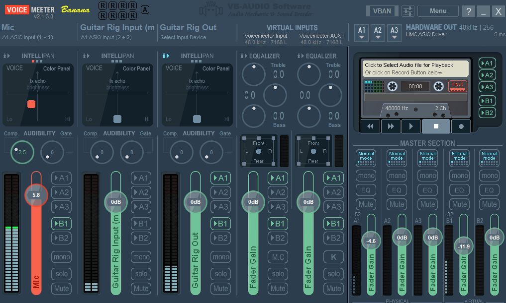
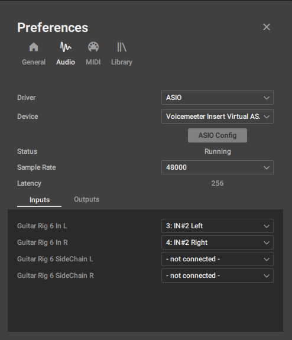
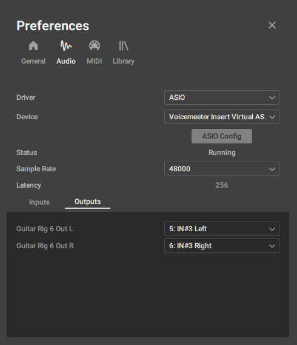
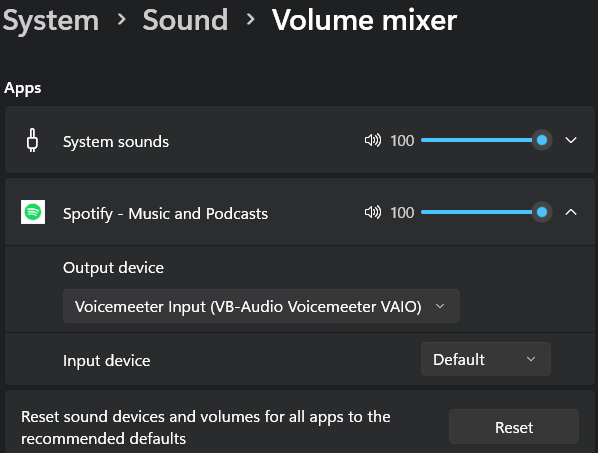
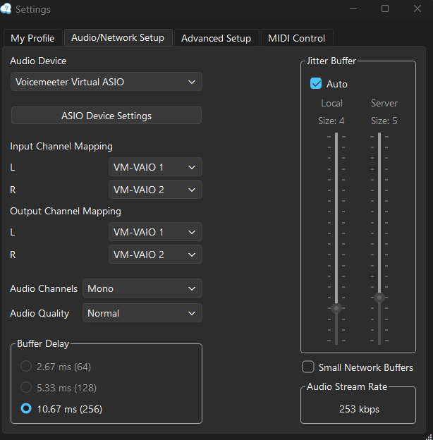

# Audio Setup

A Windows audio setup for jamming with friends over Jamulus while still being able to use the PC normally.

## Features

* Jam with friends using Jamulus

  * Send your Guitar Rig signal
  * Send your microphone signal
  * Send your Spotify audio
* Continue using Windows normally when you're not jamming

## Requirements

### Hardware

* Behringer UMC202HD

  * Input 1: Microphone
  * Input 2: Guitar
* Windows PC

### Software

* Guitar Rig 6
* Spotify
* [Jamulus](https://jamulus.app/)
* [Voicemeeter Banana](https://vb-audio.com/Voicemeeter/banana.htm)
* [UMC USB Audio Driver](https://www.behringer.com/en/products/0805-AAR)

---

## Configure Voicemeeter Banana — Part 1

You can configure Voicemeeter Banana manually using the steps below, or import the provided [configuration file](files/voice-meeter-export.xml).

> **Tip:** Enable **Auto-start Voicemeeter with Windows** and **Keep Voicemeeter in the system tray**.

### 1. Set A1 Hardware Out

Set **A1 Hardware Out** to:

`UMC ASIO Driver`

### 2. Patch ASIO Inputs to Strips

Open the ASIO input patching settings and configure:

* `IN1` → `[1] [1]`
* `IN2` → `[2] [2]`

This is needed because we need to split IN1-2 from UMC into two separate strips.

### 3. Configure the First Strip — Microphone

Disable `A1`.

This prevents you from hearing your own microphone while still allowing the signal to be sent to the hardware output.

### 4. Configure the Second Strip — Guitar Input

Disable both `A1` and `B1`.

This prevents the unprocessed guitar signal from being played back or sent directly to Jamulus. The signal will instead be routed through Guitar Rig first.

---

## Configure Guitar Rig 6

In Guitar Rig, configure the audio settings as follows:

* **Driver:** `ASIO`
* **Device:** `Voicemeeter Insert Virtual ASIO`
* **Input:** `IN#2 Left` and `IN#2 Right`
* **Output:** `IN#3 Left` and `IN#3 Right`

> This takes the guitar signal from the second strip in Voicemeeter Banana, processes it through Guitar Rig, and sends the processed signal back to the third strip.

---

## Configure Voicemeeter Banana — Part 2

Once Guitar Rig is running, an `i>` button will appear on the **third strip** in Voicemeeter Banana.

1. Click the `i>` button to enable the signal coming back from Guitar Rig.
2. Enable `A1` to hear your guitar.
3. Enable `B1` to send the processed guitar signal to Jamulus.

> **Note:** The `i>` button is only visible while Guitar Rig is running.

---

## Configure Spotify

1. Open Spotify and start playing something.
2. Open the **Windows Volume Mixer**.
3. Find Spotify and set its output device to:

   `Voicemeeter Input (VB-Audio Voicemeeter VAIO)`

> **Note:** The Spotify output setting is only visible while Spotify is open and playing audio.

---

## Configure Jamulus

In Jamulus:

1. Open **Audio Settings**.

2. Set the audio device to:

   `Voicemeeter Virtual ASIO`

3. Keep the default settings.

> **Note:** The buffer size can be adjusted through the **UMC Control Panel**.

> **Important:** Make sure to mute yourself in Jamulus to avoid hearing your own signal through the Jamulus connection.

